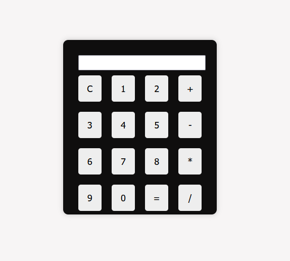

## **🖩 Simple Calculator**  

A simple and interactive calculator built using **HTML, CSS, and JavaScript**. This project provides basic arithmetic operations with a clean and responsive UI.  

### **🚀 Live Demo**  
🔗 [View Live](https://rohitbamniya4141.github.io/codsoft_taskno.3/)  

---

### **📌 Features**  
✅ Perform basic arithmetic operations (+, -, *, /)  
✅ Responsive design for different screen sizes  
✅ Interactive UI with hover effects  
✅ Lightweight and fast execution  

---

### **📷 Preview**  
  

---

### **🛠 Technologies Used**  
- **HTML** - Structure of the calculator  
- **CSS** - Styling and layout  
- **JavaScript** - Logic for calculations  

---

### **💡 Future Improvements**  
🔹 Dark mode support  
🔹 Keyboard input functionality  
🔹 More scientific functions  

---

### **📧 Contact Me**  
For any feedback or suggestions, feel free to reach out:  
📩 Email: nimcetofficial7@gmail.com  

---

🛠 **Made with ❤️ by Rohit**  
